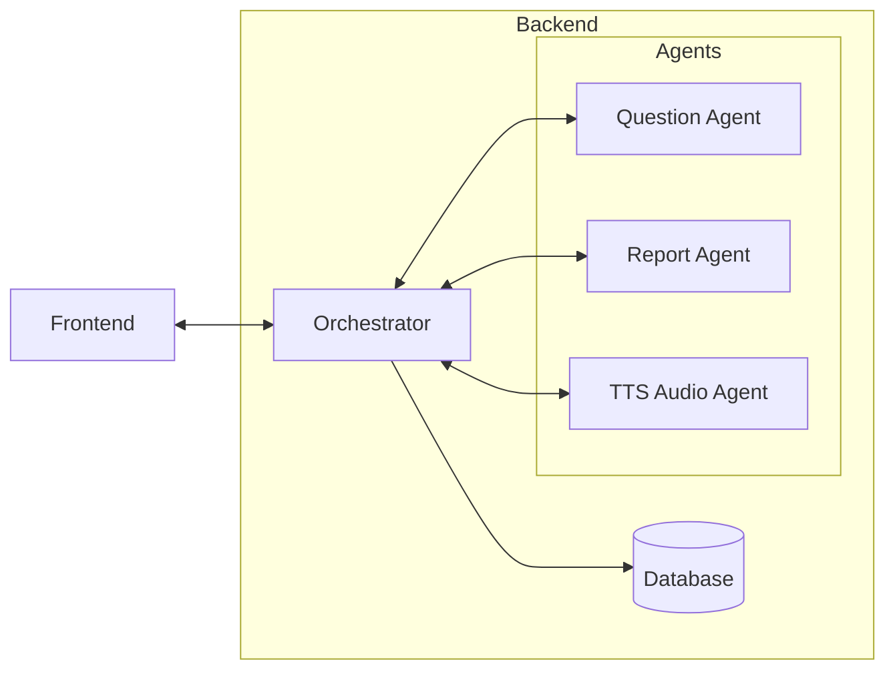

#  ⭐ Estrela do Saber

🎮 Estrela do Saber é um jogo educacional para Android que se integra a um backend baseado em um sistema multi-agente.

---
## Sobre o Jogo

> Demo: https://www.youtube.com/shorts/RXsXKLENw0Y

---
## Arquitetura

---
## Backend

> Confira o backend em: [backend](backend/README.md)

---
## Frontend

> Confira o frontend em: [frontend](frontend/README.md)
