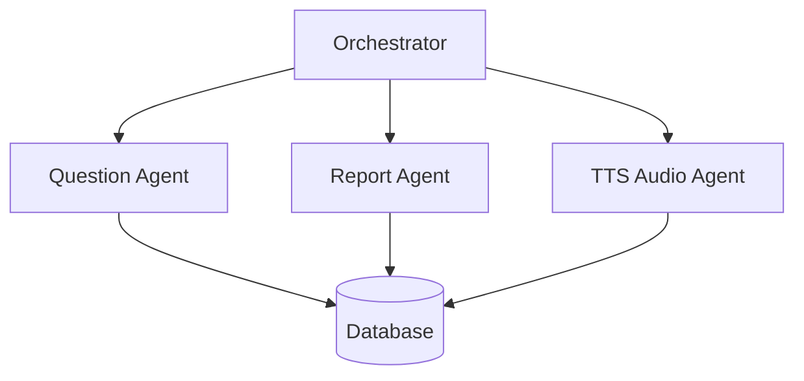

# Backend do Estrela do Saber

> Sistema multi-agente para geração de questões, avaliação e feedback narrado para crianças em fase de alfabetização.

---
## Visão Geral

Sistema modular composto por agentes especializados que:
- Gera questões pedagógicas
- Avalia respostas
- Produz feedback textual e narrado
- Mantém histórico de atividades
- Gera relatórios de desempenho

---
## Arquitetura



---
## Componentes Principais

### Agentes
- **Orchestrator**: Coordena o fluxo entre os agentes
- **Question Agent**: Gera questões adequadas ao nível educacional
- **Report Agent**: Produz relatórios e feedback pedagógico
- **TTS Agent**: Converte texto em áudio para feedback narrado

### API
Endpoints REST para:
- Solicitar novas questões
- Submeter respostas
- Recuperar histórico
- Obter relatórios

---
## Configuração

Variáveis de ambiente necessárias:
```env
OPENAI_API_KEY=chave_api_aqui
AUDIO_OUTPUT_DIR=audios
DB_URL=sqlite:///database.db
```

## Instalação e Execução

```bash
# Criar ambiente virtual
python -m venv venv
source venv/bin/activate  # Linux/Mac
# ou
venv\Scripts\activate     # Windows

# Instalar dependências
uv sync

# Executar aplicação
uvicorn src.api.main:app --reload
```

---
## Documentação da API

Após iniciar o servidor, acesse a documentação interativa da API no navegador:


```python
http://localhost:8000/docs
```